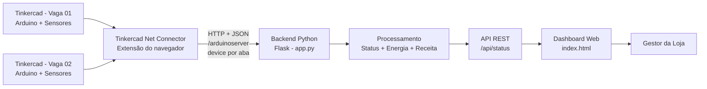

# GoodWe EV Challenge — Sprint 3
## Prototipagem Funcional e Integração

### Equipe
- Lucas Nogueira dos Santos — RM 572592
- Enzo Coppa Selingarde — RM 573393
- Gabriel Carlos Barbosa — RM 574074
- Gustavo de Souza Abreu — RM 574080

> Confirme os integrantes e RMs antes da entrega final.

## 1. Visão geral

Este projeto apresenta um protótipo funcional e simulado para monitoramento de carregadores de veículos elétricos GoodWe em um estabelecimento comercial.

A solução integra dois circuitos simulados no Tinkercad, um backend em Python com Flask e um dashboard web em HTML, permitindo acompanhar em tempo real o estado individual de cada carregador e os indicadores consolidados da loja.

O sistema demonstra:
- autenticação simulada do usuário;
- disponibilidade de energia solar;
- leitura do sensor LDR;
- leitura de temperatura;
- identificação de alta demanda;
- identificação de sobrecarga elétrica e térmica;
- status individual de cada carregador;
- potência atual;
- energia consumida por sessão;
- tempo de sessão;
- receita da sessão;
- energia total da loja;
- receita bruta acumulada;
- quantidade de sessões ativas.

## 2. Arquitetura da solução



### Fluxo de integração

1. Cada circuito no Tinkercad executa o mesmo código Arduino.
2. O Arduino envia seus dados pelo Monitor Serial em formato JSON.
3. A extensão do navegador captura o JSON e envia os dados ao Flask.
4. Cada aba do Tinkercad possui um `device` diferente, permitindo que o backend identifique cada carregador separadamente.
5. O backend processa o status, simula consumo de energia e calcula receita.
6. A rota `/api/status` disponibiliza os dados consolidados.
7. O dashboard consulta a API periodicamente e cria um card para cada carregador.

## 3. Componentes utilizados

### Simulação / hardware
- Arduino no Tinkercad;
- sensor de luminosidade LDR;
- sensor de temperatura;
- chaves para autenticação/login e energia solar;
- LEDs/saídas para indicação de alta demanda e sobrecargas;
- buzzer para alertas.

### Software
- Tinkercad Circuits;
- Arduino/C++;
- Python;
- Flask;
- JSON;
- HTML, CSS e JavaScript;
- extensão de integração entre o Tinkercad e o backend.

## 4. Justificativa técnica

O Tinkercad foi escolhido por permitir a criação e demonstração do circuito de forma simulada, sem depender de hardware físico.

O Arduino representa a camada responsável pela leitura dos sensores e pela automação local. Ele identifica condições como alta demanda e sobrecargas e disponibiliza os dados por meio do Monitor Serial.

O formato JSON foi adotado para estruturar a comunicação entre o circuito e o backend, pois é simples de interpretar tanto em Python quanto em JavaScript.

O Flask foi utilizado como backend por permitir a criação de um servidor e de uma API REST de forma simples e adequada ao protótipo.

O dashboard em HTML, CSS e JavaScript permite que o gestor visualize em um único painel vários carregadores, seus estados e indicadores de consumo e receita.

A identificação por `device` permite que vários circuitos utilizem o mesmo backend sem sobrescrever os dados uns dos outros.

## 5. Regras de funcionamento

Cada carregador possui potência simulada de **7,04 kW**.

A tarifa utilizada no protótipo é de **R$ 2,00 por kWh**.

Para facilitar a demonstração em vídeo, a simulação utiliza aceleração de tempo:

**1 segundo real = 1 minuto de recarga simulada.**

A energia é calculada por:

`Energia (kWh) = Potência (kW) × Tempo (h)`

A receita é calculada por:

`Receita (R$) = Energia (kWh) × Tarifa (R$/kWh)`

A recarga ocorre quando o usuário está autenticado e o carregador está em condição operacional.

Em caso de sobrecarga elétrica, sobrecarga térmica ou condição de bloqueio, a potência do carregador passa para zero e o acúmulo de energia e receita é interrompido enquanto o problema permanecer.

Em situação de alta demanda sem energia solar disponível, o carregador entra em estado de alerta.

## 6. Dados funcionais obtidos

Exemplo registrado durante a execução do protótipo com dois carregadores ativos:

| Indicador | Resultado |
|---|---:|
| Carregadores identificados | 2 |
| Sessões ativas | 2 |
| Potência da Vaga 01 | 7,04 kW |
| Potência da Vaga 02 | 7,04 kW |
| Potência total | 14,08 kW |
| Energia da Vaga 01 | 3,39 kWh |
| Energia da Vaga 02 | 2,05 kWh |
| Energia total informada pela API | 5,43 kWh |
| Receita da Vaga 01 | R$ 6,77 |
| Receita da Vaga 02 | R$ 4,09 |
| Receita bruta | R$ 10,86 |

A pequena diferença entre a soma dos valores exibidos por vaga e o total pode ocorrer por arredondamento, pois o backend realiza os cálculos com maior precisão e arredonda apenas os valores enviados para exibição.

## 7. Energia renovável e automação

A energia solar faz parte da lógica de operação do protótipo.

O sistema monitora a disponibilidade de energia solar e condições de demanda. Em uma situação de alta demanda sem suporte solar, o carregador entra em alerta. A proposta demonstra como uma fonte renovável pode ser considerada na tomada de decisão de uma infraestrutura de recarga.

A automação também é aplicada nas regras de segurança: condições de sobrecarga ou temperatura inadequada alteram automaticamente o estado do carregador e interrompem a simulação de consumo.

## 8. Conexão com os conteúdos da disciplina

O protótipo aplica conteúdos relacionados a:
- programação e lógica computacional;
- automação;
- comunicação entre sistemas;
- APIs;
- troca de dados em JSON;
- processamento de dados;
- integração entre hardware simulado e software;
- desenvolvimento web;
- coleta e visualização de indicadores.

Nesta Sprint, o funcionamento implementado utiliza regras determinísticas e automação. Caso inteligência artificial seja abordada como evolução futura do projeto, ela deve ser apresentada separadamente do que já está implementado no protótipo atual.

## 9. Estrutura sugerida do repositório

```text
goodwe-sprint3/
│
├── app.py
├── index.html
├── carregador.ino
├── requirements.txt
├── README.md
│
├── connector/
│   ├── manifest.json
│   ├── background.js
│   ├── content.js
│   └── demais arquivos necessários da extensão
│
└── docs/
    ├── circuito-vaga-01.png
    ├── circuito-vaga-02.png
    ├── dashboard.png
    └── api-status.png
```

> Se a extensão utilizada foi adaptada de um projeto de terceiros, inclua no repositório a referência ao projeto original e mantenha os créditos e a licença aplicável.

## 10. Como executar

### Requisitos
- Python instalado;
- Flask instalado;
- navegador Chrome ou compatível;
- extensão de integração com o Tinkercad carregada;
- circuitos do Tinkercad abertos.

### Instalação

No terminal, dentro da pasta do projeto:

```bash
pip install -r requirements.txt
```

Depois:

```bash
python app.py
```

O servidor será iniciado em:

```text
http://localhost:8080
```

API:

```text
http://localhost:8080/api/status
```

### Tinkercad

1. Abra cada circuito em uma aba diferente.
2. Inicie a simulação.
3. Abra o Monitor Serial.
4. Certifique-se de que a extensão esteja configurada para enviar os dados para:

```text
http://127.0.0.1:8080/arduinoserver
```

5. Abra o dashboard no navegador.
6. Altere login, energia solar, LDR e temperatura no circuito para observar a atualização do sistema.

## 11. Demonstração

O vídeo da Sprint 3 apresenta:
- os dois circuitos no Tinkercad;
- os sensores e componentes;
- o envio dos dados pelo Serial;
- a identificação individual de cada carregador;
- o backend Flask;
- a API retornando os dois carregadores;
- o dashboard em tempo real;
- início e encerramento de sessões;
- cálculo de energia e receita;
- comportamento diante de alertas e sobrecargas;
- participação da energia solar na lógica de operação.

## 12. Resultado

O protótipo atingiu a integração entre circuito simulado, backend e interface web.

Com uma única aplicação Flask, o sistema consegue receber dados de múltiplos carregadores, tratá-los individualmente e consolidar indicadores para o gestor da loja.

A solução demonstra um caminho para monitoramento de infraestrutura de recarga de veículos elétricos com automação, segurança operacional, acompanhamento energético e consideração de fontes renováveis.
